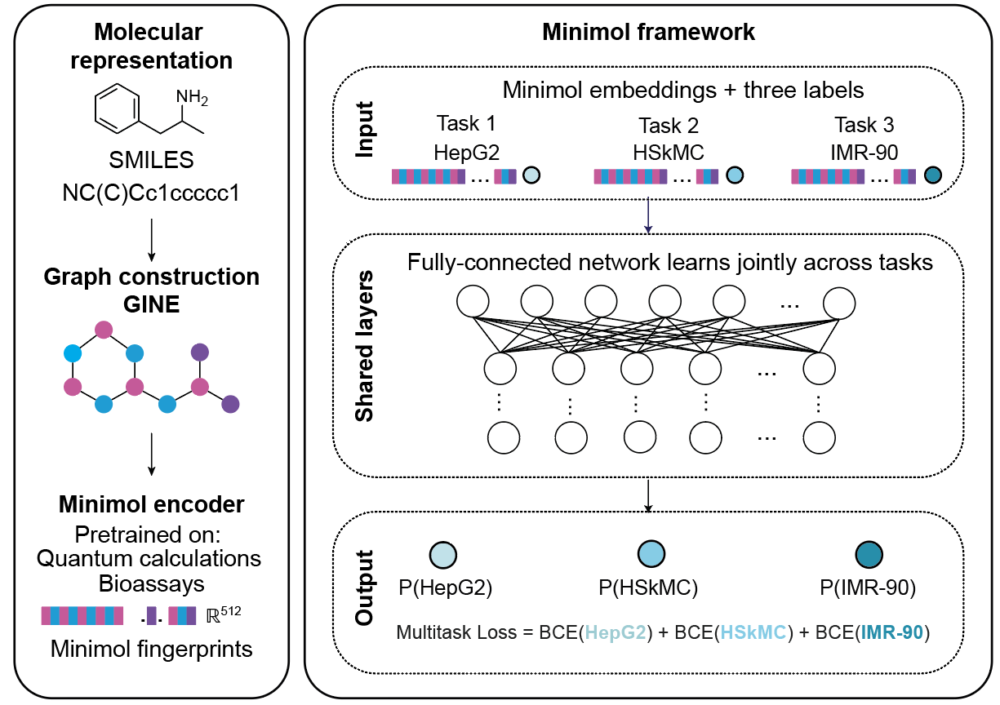

# SafetyNet

SafetyNet predicts multitask cytotoxicity and antibiotic activity from MiniMol molecular representations. This repository contains datasets, trained checkpoints, model code, and analysis utilities.



## Repository layout

| Directory | Contents |
| --- | --- |
| `datasets/antibiotic_activity_datasets` | Antibiotic activity tables |
| `datasets/toxicity_datasets` | Cytotoxicity tables |
| `models/antibiotic_activity_model` | Antibiotic scoring code and checkpoints |
| `models/safetynet` | SafetyNet network, training, scoring, and checkpoints |
| `models/cli_code` | Existing training and prediction interfaces |
| `models/featurization` | MiniMol and Morgan fingerprint utilities |
| `other` | Evaluation and visualization scripts |
| `examples` | A ten-molecule scoring example |
| `docs` | Development guidance and dated repository records |

## Installation

Use Python 3.10 or newer. The environment specification in `other/envs/environment.yml` provides the scientific Python stack. Install this repository in editable mode to expose the `safetynet` import namespace and its existing commands.

```bash
SAFETYNET_ROOT="/Users/asselism/Desktop/Collins_Lab/Repositories/safetynet-private"
python -m pip install -e "${SAFETYNET_ROOT}"
git -C "${SAFETYNET_ROOT}" lfs pull
```

The checkpoint files and the large CO-ADD dataset use Git Large File Storage (LFS). A pointer file without its downloaded content cannot be loaded as a model.

MiniMol requires its compatible PyTorch Geometric dependencies. Follow the [MiniMol installation instructions](https://github.com/graphcore-research/minimol#installation) for your platform. MiniMol is loaded only when new molecular representations are needed. Precomputed representations can be scored without initializing it.

The separate Ray Tune hyperparameter search requires the optional dependencies installed with `python -m pip install -e "${SAFETYNET_ROOT}[tune]"`.

## Score molecules

```bash
bash "${SAFETYNET_ROOT}/examples/run_example_score.sh"
```

The example writes `outputs/example_scored.tsv` beneath the checkout and runs on the CPU by default. See [the example guide](examples/readme_example_score.md) for input requirements and output definitions.

To score a different table, pass absolute paths to the existing interface.

```bash
python -m safetynet.cli.safetynet_score \
  --input "${SAFETYNET_ROOT}/examples/example_smiles.csv" \
  --output "${SAFETYNET_ROOT}/outputs/scored.tsv" \
  --smiles-col SMILES \
  --abx-model-dir "${SAFETYNET_ROOT}/models/antibiotic_activity_model/antibiotic_model_checkpoints" \
  --tox-model-dir "${SAFETYNET_ROOT}/models/safetynet/safetynet_checkpoints" \
  --tox-device cpu
```

Scoring reuses an existing `Minimol_Fingerprint` column or computes representations from SMILES. It processes the input in chunks, retains row order and metadata, averages all available ensemble members, and replaces the final output only after successful completion.

## Training and individual checkpoints

The `safetynet_train` interface trains a multitask classifier using the requested hidden-layer widths and optimizer settings. It supports missing endpoint labels and evaluates the best validation-loss checkpoint on a held-out test split. The `safetynet_predict` interface applies an individual checkpoint.

```bash
python -m safetynet.cli.safetynet_train --help
python -m safetynet.cli.safetynet_predict --help
```

These interfaces accept existing MiniMol representations or generate them from a specified SMILES column. The supplied pretrained checkpoints expect 512 input features. A valid vector of another width is rejected before model inference.

## Analysis and validation

[Analysis utilities](other/readme_analysis_scripts.md) cover molecular fingerprints, two-dimensional representation plots, activity-versus-toxicity plots, and binary prediction metrics. [Development guidance](docs/development.md) describes package layout, tests, and checkpoint conventions.

```bash
python -m unittest discover -s "${SAFETYNET_ROOT}/tests" -v
```

## Citation

If you use SafetyNet or its pretrained models in your work, please cite:

> Zhang Y., Hennes A., Krishnan A., Omori S., Li A., *et al.*  
> **Multitask learning enriches the discovery of nontoxic antibiotics.** (2025)  
> Manuscript in preparation.

---

## Related projects

- [MiniMol](https://github.com/graphcore-research/minimol) — Pretrained molecular embeddings
- [Chemprop](https://github.com/chemprop/chemprop) — GNN baseline framework  
- [PyTorch Lightning](https://github.com/Lightning-AI/pytorch-lightning) — High-level training loop  
- [Ray Tune](https://docs.ray.io/en/latest/tune/index.html) — Hyperparameter optimization

---

## Contact

For questions, issues, or feature requests, please open a GitHub issue or contact:

- **Yu Zhang** – [@yuzhang-io](https://github.com/yuzhang-io)
- **Andrew Hennes** – [@AndrewHennes](https://github.com/AndrewHennes/)
